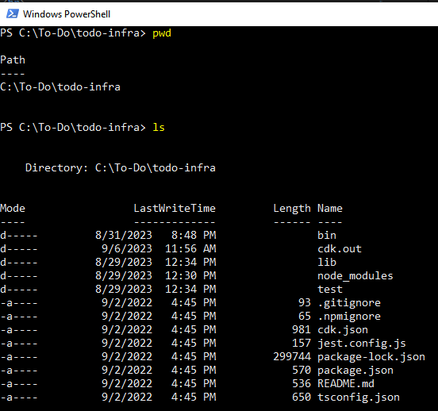

# Guide for Deployment Using AWS CDK
 

#### Requirement
1. Node Package Manager, **NPM**
    - https://nodejs.org/en/download
    - https://docs.npmjs.com/downloading-and-installing-node-js-and-npm
2. **AWS CLI**
    - https://docs.aws.amazon.com/cli/latest/userguide/getting-started-install.html
3. AWS Cloud Development Kit, **AWS CDK**

 
 

## Configure CDK
1. Configure AWS credential
    * Create access key on AWS Account / IAM
        - 
    * Open terminal, run `aws configure`
    * Put credential created in AWS Management Console
        - Access Key, Secret Access Key, Specify region, specify output format
        - 

 
 

## Destroying Stack
1. Open terminal
2. Go to folder for infrastucture deployment
    * 
3. List all available stack available in the folder
    * Could be more than 1 stack
    * 
4. Destroy stack, wait for completion
    * run command `cdk destroy`
        - 
        - .png)
5. Verify stack detroyed on AWS Management Console (CloudFormation)
    * 
    * .png)

 
 

#### References
- https://docs.aws.amazon.com/cdk/v2/guide/home.html
- https://docs.aws.amazon.com/cdk/v2/guide/getting_started.html
- [▶ How To Build a CRUD (TO-DO) App on AWS using FastAPI and Python](https://www.youtube.com/watch?v=iLt00bqp6is)
- [▶ AWS CDK Overview with Stack and Constructs (different examples and use cases)](https://www.youtube.com/watch?v=h_gRGRbOjJ8)
